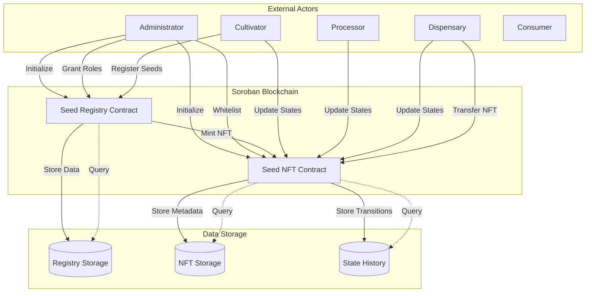
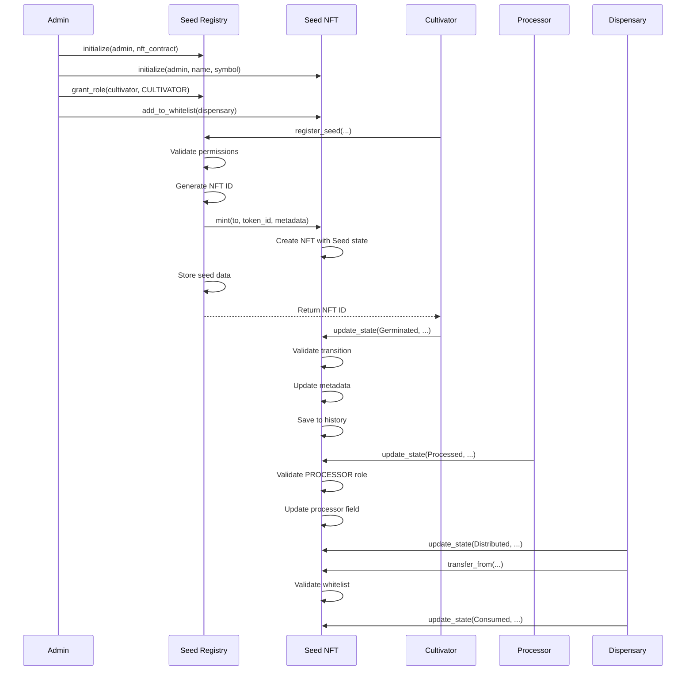
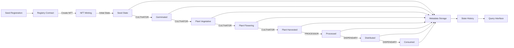
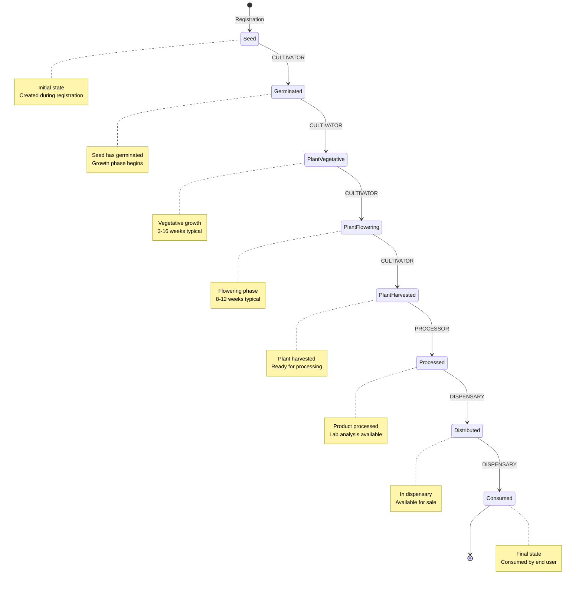
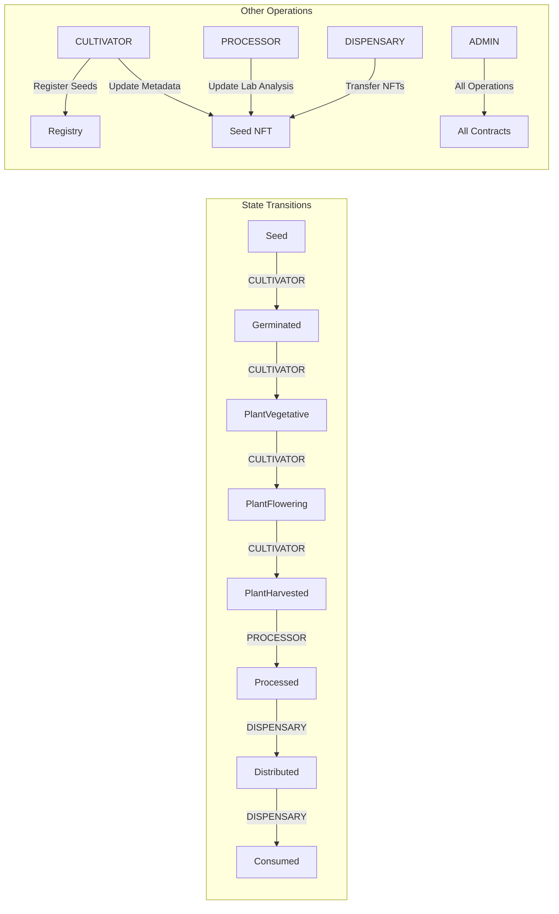
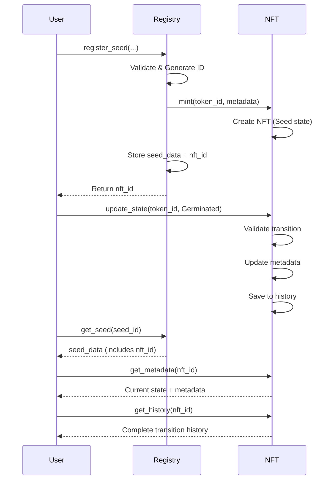

# Cannabis Seed Traceability System

A comprehensive blockchain-based traceability system for cannabis seeds built on Stellar's Soroban smart contract platform. This system provides end-to-end tracking from seed registration through cultivation, processing, distribution, and final consumption, ensuring regulatory compliance and complete supply chain transparency.

## Table of Contents

1. [System Overview](#system-overview)
2. [Architecture](#architecture)
3. [Project Structure](#project-structure)
4. [Smart Contracts](#smart-contracts)
5. [Lifecycle Management](#lifecycle-management)
6. [Technical Stack](#technical-stack)
7. [Development Setup](#development-setup)
8. [Contract Integration](#contract-integration)
9. [Security Features](#security-features)
10. [References](#references)

---

## System Overview

### Objectives

The Cannabis Seed Traceability System is designed to address critical requirements in the regulated cannabis industry:

- **Complete Traceability**: Immutable record of every seed from registration to consumption
- **Regulatory Compliance**: Facilitates compliance with cannabis regulations for dispensaries and cannabis clubs
- **Supply Chain Transparency**: Verifiable information about origin, processing, and distribution
- **Access Control**: Granular role-based permission system ensuring only authorized parties can perform specific actions
- **Data Integrity**: Immutable historical data that cannot be modified or deleted

### Use Cases

- Legal dispensaries requiring product provenance documentation
- Cannabis clubs needing traceability for regulatory compliance
- Regulatory bodies auditing supply chain integrity
- Consumers verifying product quality, origin, and authenticity
- Processors tracking batch processing and laboratory analysis

### Technical Foundation

Built on **Stellar Soroban**, a secure, scalable smart contract platform that compiles Rust code to WebAssembly (WASM) for deterministic execution. The system leverages OpenZeppelin's audited Stellar contract libraries for security and standards compliance.

---

## Architecture

### High-Level System Architecture



### Contract Interaction Flow



### Data Flow Diagram



---

## Project Structure

```
dispensario_digital_sc/
├── contracts/                          # Soroban smart contracts workspace
│   ├── Cargo.toml                     # Workspace configuration
│   ├── Cargo.lock                     # Dependency lock file
│   ├── rust-toolchain.toml            # Rust toolchain specification
│   ├── seed-registry/                 # Seed Registry contract
│   │   ├── Cargo.toml
│   │   └── src/
│   │       ├── lib.rs                 # Main contract implementation
│   │       ├── registry.rs            # Registry logic
│   │       ├── seed_data.rs           # SeedData structure
│   │       ├── roles.rs               # Role definitions
│   │       └── test.rs                # Unit tests
│   └── seed-nft/                      # Seed NFT contract
│       ├── Cargo.toml
│       └── src/
│           ├── lib.rs                 # Main contract implementation
│           ├── nft.rs                 # NFT helper functions
│           ├── lifecycle.rs           # Lifecycle state definitions
│           ├── metadata.rs            # Metadata structures
│           ├── history.rs             # History management
│           ├── roles.rs               # Role definitions
│           └── test.rs                # Unit tests
├── docs/                              # Technical documentation
│   ├── en/
│   │   ├── CANNABIS_TRACEABILITY_CONTRACTS.md
│   │   └── SOROBAN_CONTRACTS_DOCUMENTATION.md
│   └── es/
│       ├── CONTRATOS_TRAZABILIDAD_CANNABIS.md
│       └── CONTRATOS_SOROBAN_DOCUMENTACION.md
└── README.md                          # This file
```

### Build Artifacts

Compiled WASM binaries are generated in:
```
contracts/target/wasm32v1-none/release/
├── seed_registry.wasm
└── seed_nft.wasm
```

---

## Smart Contracts

### Seed Registry Contract

**Location**: [`contracts/seed-registry/`](contracts/seed-registry/)

**Deployed (Testnet)**: `CCH7E2JN7PJRLKISN42XAL4MSBHFR7Z645AXT46BH3SPZKCOZN26LWCH` | [Explorer](https://stellar.expert/explorer/testnet/contract/CCH7E2JN7PJRLKISN42XAL4MSBHFR7Z645AXT46BH3SPZKCOZN26LWCH) | [Deployment TX](https://stellar.expert/explorer/testnet/tx/6e162b9d74e9dfa730e39474a33b6cf4afe06727677f82a57f2856f41e3c3924)

The Seed Registry contract serves as the central entry point for all seed registrations. It maintains a master registry of all seeds and coordinates the creation of corresponding NFTs in the Seed NFT contract.

#### Core Responsibilities

- Seed registration and data management
- NFT creation coordination
- Seed querying and filtering
- Batch registration operations
- Role-based access control

#### Key Functions

**Initialization**
```rust
pub fn initialize(env: Env, admin: Address, nft_contract: Address)
```
- Sets up the registry contract
- Assigns ADMIN role to the specified address
- Stores reference to the NFT contract
- Can only be executed once

**Seed Registration**
```rust
pub fn register_seed(
    env: Env,
    seed_id: String,
    variety: String,
    batch: String,
    origin_country: String,
    seed_bank: String,
    expected_thc: Option<u32>,
    expected_cbd: Option<u32>,
    organic_certified: bool,
) -> u128
```
- Registers a new seed in the system
- Requires CULTIVATOR role
- Automatically creates corresponding NFT
- Returns the generated NFT ID
- Emits `SeedRegisteredEvent`

**Batch Registration**
```rust
pub fn register_seeds_batch(
    env: Env,
    seed_ids: Vec<String>,
    varieties: Vec<String>,
    batches: Vec<String>,
    origin_countries: Vec<String>,
    seed_banks: Vec<String>,
    expected_thcs: Vec<Option<u32>>,
    expected_cbds: Vec<Option<u32>>,
    organic_certified_flags: Vec<bool>,
) -> Vec<u128>
```
- Registers up to 100 seeds in a single transaction
- Atomic operation - all or nothing
- Skips seeds that already exist
- Returns vector of created NFT IDs

**Query Functions**
- `get_seed(env: Env, seed_id: String) -> Option<SeedData>`: Retrieve complete seed data
- `get_seed_count(env: Env) -> u64`: Total number of registered seeds
- `get_all_seed_ids(env: Env) -> Vec<String>`: List of all seed IDs
- `query_seeds_by_variety(env: Env, variety: String) -> Vec<String>`: Filter by variety
- `query_seeds_by_batch(env: Env, batch: String) -> Vec<String>`: Filter by batch
- `query_seeds_by_creator(env: Env, creator: Address) -> Vec<String>`: Filter by creator

#### Storage Structure

**Instance Storage**
- `INIT`: Initialization flag (bool)
- `PAUSED`: Pause state (bool)
- `SEED_CNT`: Total seed counter (u64)
- `NFT_CNTRCT`: NFT contract address (Address)

**Persistent Storage**
- `(SEED_DATA, seed_id)`: Complete seed data (SeedData)
- `(SEED_IDS)`: List of all seed IDs (Vec<String>)
- `(ROLE_KEY, address)`: Role assignments (bool)

#### Data Structure

The `SeedData` structure (defined in [`contracts/seed-registry/src/seed_data.rs`](contracts/seed-registry/src/seed_data.rs)) contains:

```rust
pub struct SeedData {
    pub id: String,                    // Unique seed identifier
    pub created_at: u64,               // Creation timestamp
    pub creator: Address,               // Address that registered the seed
    pub variety: String,               // Variety/genetics
    pub batch: String,                 // Batch number
    pub origin_country: String,        // Country of origin
    pub seed_bank: String,             // Seed bank identifier
    pub expected_thc: Option<u32>,      // Expected THC percentage
    pub expected_cbd: Option<u32>,      // Expected CBD percentage
    pub organic_certified: bool,        // Organic certification flag
    pub nft_id: u128,                  // Associated NFT ID
    pub nft_contract: Address,         // NFT contract address
}
```

**Detailed Documentation**: See [`docs/en/CANNABIS_TRACEABILITY_CONTRACTS.md`](docs/en/CANNABIS_TRACEABILITY_CONTRACTS.md#seed-registry-contract)

---

### Seed NFT Contract

**Location**: [`contracts/seed-nft/`](contracts/seed-nft/)

**Deployed (Testnet)**: `CBFAKC5FEARMXLTIJRIGXREMSNRNWRWNKPJUJYMH6ER7ELWHCEC6MXDU` | [Explorer](https://stellar.expert/explorer/testnet/contract/CBFAKC5FEARMXLTIJRIGXREMSNRNWRWNKPJUJYMH6ER7ELWHCEC6MXDU) | [Deployment TX](https://stellar.expert/explorer/testnet/tx/19cdf3caa6d5ebbd38103785110ee6cda4c238624e01fd3618761b83e4b71e57)

The Seed NFT contract implements a non-fungible token system based on OpenZeppelin's Stellar NonFungibleToken standard. Each NFT represents a unique seed and maintains its complete lifecycle state, metadata, and transition history.

#### Core Responsibilities

- NFT minting and management
- Lifecycle state management
- Metadata storage and updates
- State transition history
- Transfer control via whitelist
- OpenSea metadata compatibility

#### Key Functions

**Initialization**
```rust
pub fn initialize(env: Env, admin: Address, name: String, symbol: String)
```
- Initializes the NFT contract
- Sets token name and symbol
- Assigns ADMIN role
- Configures pause state

**Minting**
```rust
pub fn mint(
    env: Env,
    to: Address,
    token_id: u128,
    name: String,
    description: String,
    image: String,
    external_url: Option<String>,
    attributes: Vec<Attribute>,
)
```
- Creates a new NFT representing a seed
- Initializes metadata with Seed state
- Sets OpenSea-compatible fields
- Emits `MintEvent`

**State Updates**
```rust
pub fn update_state(
    env: Env,
    caller: Address,
    token_id: u128,
    new_state: u32,
    location: Option<String>,
    temperature: Option<i32>,
    humidity: Option<u32>,
    notes: Option<String>,
)
```
- Updates the lifecycle state of an NFT
- Validates state transition rules
- Requires appropriate role for target state
- Updates metadata fields
- Saves transition to history
- Emits `StateTransitionEvent`

**Metadata Updates**
```rust
pub fn update_metadata(
    env: Env,
    caller: Address,
    token_id: u128,
    location: Option<String>,
    temperature: Option<i32>,
    humidity: Option<u32>,
    lab_analysis: Option<String>,
    opensea_metadata: Option<OpenSeaMetadata>,
)
```
- Updates metadata without changing state
- Requires CULTIVATOR role
- Supports both traceability and OpenSea fields
- Emits `MetadataUpdateEvent`

**Query Functions**
- `get_metadata(env: Env, token_id: u128) -> Option<SeedMetadata>`: Retrieve complete metadata
- `get_history(env: Env, token_id: u128) -> Vec<StateTransition>`: Get state transition history

**Whitelist Management**
- `add_to_whitelist(env: Env, caller: Address, account: Address)`: Add address to whitelist (ADMIN only)
- `remove_from_whitelist(env: Env, caller: Address, account: Address)`: Remove address from whitelist (ADMIN only)
- `is_whitelisted(env: Env, account: Address) -> bool`: Check whitelist status

**Standard NFT Functions**

Implements OpenZeppelin's NonFungibleToken interface:
- `name()`: Token name
- `symbol()`: Token symbol
- `balance_of(owner: Address) -> u32`: Balance of NFTs for an address
- `owner_of(token_id: u32) -> Address`: Owner of a specific NFT
- `approve(approver: Address, approved: Address, token_id: u32, live_until_ledger: u32)`: Approve transfer
- `get_approved(token_id: u32) -> Address`: Get current approval
- `set_approval_for_all(owner: Address, operator: Address, approved: bool)`: Approve all tokens
- `is_approved_for_all(owner: Address, operator: Address) -> bool`: Check global approval
- `transfer_from(spender: Address, from: Address, to: Address, token_id: u32)`: Transfer NFT (validates whitelist)

#### Storage Structure

**Instance Storage**
- `INIT`: Initialization flag (bool)
- `PAUSED`: Pause state (bool)
- `TOKEN`: NonFungibleToken instance

**Persistent Storage**
- `(METADATA, token_id)`: NFT metadata (SeedMetadata)
- `(HISTORY, token_id)`: State transition history (Vec<StateTransition>)
- `(WHITELIST, address)`: Whitelist entries (bool)
- `(ROLE_KEY, address)`: Role assignments (bool)

#### Metadata Structure

The `SeedMetadata` structure (defined in [`contracts/seed-nft/src/metadata.rs`](contracts/seed-nft/src/metadata.rs)) includes:

**Traceability Fields**
- `state: LifecycleState`: Current lifecycle state
- `location: Option<String>`: GPS coordinates or location description
- `temperature: Option<i32>`: Temperature in Celsius
- `humidity: Option<u32>`: Relative humidity percentage
- `lab_analysis: Option<String>`: Laboratory analysis reference
- `processor: Option<Address>`: Processor address (set when Processed)
- `distributor: Option<Address>`: Distributor address (set when Distributed)
- `consumer: Option<Address>`: Consumer address (set when Consumed)
- `updated_at: u64`: Last update timestamp

**OpenSea-Compatible Fields**
- `name: String`: NFT name (required)
- `description: String`: NFT description (required)
- `image: String`: Image URL (required)
- `external_url: Option<String>`: External URL (optional)
- `attributes: Vec<Attribute>`: List of attributes/traits

#### OpenSea Compatibility

The contract implements the OpenSea metadata standard, enabling proper display on NFT marketplaces and explorers. All required fields (`name`, `description`, `image`) must be provided during minting, and optional fields can be updated via `update_metadata`.

**Detailed Documentation**: See [`docs/en/CANNABIS_TRACEABILITY_CONTRACTS.md`](docs/en/CANNABIS_TRACEABILITY_CONTRACTS.md#seed-nft-contract)

---

## Lifecycle Management

### State Machine

The system defines 8 distinct lifecycle states representing the complete journey of a cannabis seed from registration to consumption:



### State Definitions

| State | Value | Description | Responsible Role | Typical Duration |
|-------|-------|-------------|------------------|------------------|
| `Seed` | 0 | Initial state when seed is registered | System (automatic) | Until germination |
| `Germinated` | 1 | Seed has germinated and begun growing | CULTIVATOR | 1-2 weeks |
| `PlantVegetative` | 2 | Plant in vegetative growth phase | CULTIVATOR | 3-16 weeks |
| `PlantFlowering` | 3 | Plant in flowering phase | CULTIVATOR | 8-12 weeks |
| `PlantHarvested` | 4 | Plant has been harvested | CULTIVATOR | Until processing |
| `Processed` | 5 | Product has been processed | PROCESSOR | Until distribution |
| `Distributed` | 6 | Product is in dispensary | DISPENSARY | Until sale |
| `Consumed` | 7 | Product has been consumed | DISPENSARY | Final state |

### Transition Rules

State transitions are strictly validated to ensure data integrity:

1. **Sequentiality**: Only transitions to the next sequential state are allowed
2. **No Rollback**: Cannot return to a previous state
3. **No Skipping**: Cannot skip intermediate states
4. **Role Validation**: Each transition requires the appropriate role

**Valid Transition Matrix** (defined in [`contracts/seed-nft/src/lifecycle.rs`](contracts/seed-nft/src/lifecycle.rs)):

```rust
pub fn can_transition_to(self, to: LifecycleState) -> bool {
    match (self, to) {
        (Seed, Germinated) => true,
        (Germinated, PlantVegetative) => true,
        (PlantVegetative, PlantFlowering) => true,
        (PlantFlowering, PlantHarvested) => true,
        (PlantHarvested, Processed) => true,
        (Processed, Distributed) => true,
        (Distributed, Consumed) => true,
        _ => false,  // Any other transition is invalid
    }
}
```

### Role-Based Permissions



### State Transition History

Every state transition is recorded with:
- `from_state`: Previous state
- `to_state`: New state
- `timestamp`: Ledger timestamp of the transition
- `updated_by`: Address that performed the update
- `notes`: Optional additional notes

This creates an immutable audit trail accessible via `get_history(token_id)`.

---

## Technical Stack

### Core Technologies

- **Rust**: 1.89.0 (as specified in [`contracts/rust-toolchain.toml`](contracts/rust-toolchain.toml))
- **Soroban SDK**: 23.1.0
- **OpenZeppelin Stellar Contracts**: v0.5.1
  - `stellar-access`: Access control patterns
  - `stellar-tokens`: NonFungibleToken implementation
  - `stellar-macros`: Procedural macros

### Compilation Target

- **Target**: `wasm32v1-none` (WebAssembly for Soroban v1)
- **Optimization**: Size-optimized release builds (`opt-level = "z"`)
- **LTO**: Link-Time Optimization enabled
- **Panic**: Abort on panic (reduces binary size)

### Workspace Configuration

The contracts are organized as a Cargo workspace (see [`contracts/Cargo.toml`](contracts/Cargo.toml)):

- **Members**: `seed-registry`, `seed-nft`
- **Resolver**: Version 2
- **Shared Dependencies**: Defined in `[workspace.dependencies]`
- **Release Profile**: Optimized for minimal WASM binary size

---

## Development Setup

### Prerequisites

- **Rust**: 1.89.0 or compatible
- **Cargo**: Latest stable
- **rustup**: For managing Rust toolchains
- **Stellar CLI**: For contract deployment and testing (optional)
- **Docker**: For local network testing (optional)

### Installation

1. **Install Rust Toolchain**

```bash
# Install rustup if not already installed
curl --proto '=https' --tlsv1.2 -sSf https://sh.rustup.rs | sh

# Add WASM target
rustup target add wasm32v1-none
```

2. **Clone Repository**

```bash
git clone <repository-url>
cd dispensario_digital_sc
```

3. **Verify Toolchain**

The project uses a specific Rust version defined in [`contracts/rust-toolchain.toml`](contracts/rust-toolchain.toml). Cargo will automatically use this version when building.

### Build Instructions

**Build All Contracts**

```bash
cd contracts
cargo build --target wasm32v1-none --release
```

**Build Specific Contract**

```bash
# Build Seed Registry
cargo build --target wasm32v1-none --release --package seed-registry

# Build Seed NFT
cargo build --target wasm32v1-none --release --package seed-nft
```

**Output Location**

Compiled WASM binaries:
```
contracts/target/wasm32v1-none/release/seed_registry.wasm
contracts/target/wasm32v1-none/release/seed_nft.wasm
```

### Testing

**Run All Tests**

```bash
cd contracts
cargo test
```

**Run Tests for Specific Contract**

```bash
# Test Seed Registry
cargo test --package seed-registry

# Test Seed NFT
cargo test --package seed-nft
```

**Test with Detailed Output**

```bash
cargo test --package seed-registry -- --nocapture
```

### Local Network Deployment

For testing on a local Stellar network:

1. **Start Local Network**

```bash
docker run --rm -it \
  -p 8000:8000 \
  -p 8001:8001 \
  --name stellar \
  stellar/quickstart:testing \
  --standalone \
  --enable-soroban-rpc
```

2. **Configure Stellar CLI**

```bash
stellar network use local
stellar keys generate admin
stellar keys fund admin
```

3. **Deploy Contracts**

```bash
# Deploy Seed NFT
stellar contract deploy \
  --wasm contracts/target/wasm32v1-none/release/seed_nft.wasm \
  --alias seed-nft

# Deploy Seed Registry
stellar contract deploy \
  --wasm contracts/target/wasm32v1-none/release/seed_registry.wasm \
  --alias seed-registry
```

4. **Initialize Contracts**

```bash
# Initialize NFT contract
stellar contract invoke \
  --id seed-nft \
  -- initialize \
  --admin $(stellar keys address admin) \
  --name "Cannabis Seed NFT" \
  --symbol "CSNFT"

# Initialize Registry contract
stellar contract invoke \
  --id seed-registry \
  -- initialize \
  --admin $(stellar keys address admin) \
  --nft_contract $(stellar contract id seed-nft)
```

**Detailed Deployment Guide**: See [`docs/en/SOROBAN_CONTRACTS_DOCUMENTATION.md`](docs/en/SOROBAN_CONTRACTS_DOCUMENTATION.md#deployment-and-testing-on-local-network)

---

## Contract Integration

### Integration Architecture

The Seed Registry and Seed NFT contracts work together to provide complete traceability:

1. **Registry as Entry Point**: All seed registrations go through the Registry
2. **NFT as State Manager**: Lifecycle states are managed in the NFT contract
3. **Cross-References**: Registry stores NFT ID and contract address
4. **Synchronized Operations**: NFT creation is atomic with seed registration

### Integration Flow



### Event System

Both contracts emit events for off-chain monitoring and indexing:

**Registry Events**
- `SeedRegisteredEvent`: Emitted when a seed is registered
- `SeedRegisteredBatchEvent`: Emitted for each seed in batch registration
- `RoleGrantEvent` / `RoleRevokeEvent`: Role management events
- `PausedEvent` / `UnpausedEvent`: Pause state changes

**NFT Events**
- `MintEvent`: Emitted when NFT is created
- `StateTransitionEvent`: Emitted on state changes
- `MetadataUpdateEvent`: Emitted on metadata updates
- `WhitelistEvent`: Whitelist changes
- `Transfer`: Standard NFT transfer event

### Synchronization Mechanisms

1. **Unique ID Generation**: Registry generates sequential NFT IDs
2. **Atomic Operations**: Seed registration and NFT minting are atomic
3. **Immutable References**: Once created, NFT cannot be deleted
4. **Event Correlation**: Events can be correlated via seed_id and token_id

---

## Security Features

### Role-Based Access Control (RBAC)

The system implements granular role-based permissions:

| Role | Permissions |
|------|-------------|
| **ADMIN** | Full contract control, pause/unpause, role management, whitelist management |
| **CULTIVATOR** | Register seeds, update states (Germinated → PlantHarvested), update metadata |
| **PROCESSOR** | Update state to Processed, update processing-related metadata |
| **DISPENSARY** | Update states (Distributed, Consumed), transfer NFTs |
| **CONSUMER** | Reserved for future functionality |

**Role Storage**: Roles are stored in persistent storage with key pattern `(ROLE_KEY, address) → bool`

### Whitelist System

NFT transfers are restricted to whitelisted addresses:

- Only ADMIN can add/remove addresses from whitelist
- `transfer_from()` validates recipient is whitelisted before allowing transfer
- Prevents unauthorized NFT transfers
- Enables controlled supply chain flow

### Pause Functionality

Both contracts implement pause mechanisms:

- Only ADMIN can pause/unpause
- Paused contracts reject all state-modifying operations
- Query functions remain available when paused
- Useful for emergency response or contract upgrades

### State Transition Validation

Multiple layers of validation ensure data integrity:

1. **Sequential Validation**: Only next state transitions allowed
2. **Role Validation**: Appropriate role required for target state
3. **Authentication**: All state updates require `require_auth()`
4. **Immutable History**: Once recorded, transitions cannot be modified

### Input Validation

- Seed ID uniqueness checked before registration
- Batch size limits (max 100 seeds per batch)
- Vector length validation in batch operations
- Type and format validation on all inputs

### Security Best Practices

- **Principle of Least Privilege**: Roles grant minimum necessary permissions
- **Immutable Data**: Historical data cannot be modified
- **Event Logging**: All critical operations emit events for auditing
- **Deterministic Execution**: WASM ensures consistent behavior
- **Gas Optimization**: Efficient storage usage reduces attack surface

---

## References

### Project Documentation

- **Detailed Contract Documentation**: [`docs/en/CANNABIS_TRACEABILITY_CONTRACTS.md`](docs/en/CANNABIS_TRACEABILITY_CONTRACTS.md)
  - Complete function reference
  - Usage examples
  - Workflow documentation
  - Security considerations

- **Soroban Workspace Documentation**: [`docs/en/SOROBAN_CONTRACTS_DOCUMENTATION.md`](docs/en/SOROBAN_CONTRACTS_DOCUMENTATION.md)
  - Development guide
  - Compilation and testing
  - Local network deployment
  - Best practices

### Source Code

- **Seed Registry Contract**: [`contracts/seed-registry/src/`](contracts/seed-registry/src/)
  - Main implementation: [`lib.rs`](contracts/seed-registry/src/lib.rs)
  - Registry logic: [`registry.rs`](contracts/seed-registry/src/registry.rs)
  - Data structures: [`seed_data.rs`](contracts/seed-registry/src/seed_data.rs)

- **Seed NFT Contract**: [`contracts/seed-nft/src/`](contracts/seed-nft/src/)
  - Main implementation: [`lib.rs`](contracts/seed-nft/src/lib.rs)
  - Lifecycle states: [`lifecycle.rs`](contracts/seed-nft/src/lifecycle.rs)
  - Metadata structures: [`metadata.rs`](contracts/seed-nft/src/metadata.rs)

- **Workspace Configuration**: [`contracts/Cargo.toml`](contracts/Cargo.toml)
- **Rust Toolchain**: [`contracts/rust-toolchain.toml`](contracts/rust-toolchain.toml)

### Deployed Contracts (Testnet)

#### Seed NFT Contract

- **Contract Address**: `CBFAKC5FEARMXLTIJRIGXREMSNRNWRWNKPJUJYMH6ER7ELWHCEC6MXDU`
- **Explorer**: [View on Stellar Expert](https://stellar.expert/explorer/testnet/contract/CBFAKC5FEARMXLTIJRIGXREMSNRNWRWNKPJUJYMH6ER7ELWHCEC6MXDU)
- **Deployment Transaction**: [19cdf3caa6d5ebbd38103785110ee6cda4c238624e01fd3618761b83e4b71e57](https://stellar.expert/explorer/testnet/tx/19cdf3caa6d5ebbd38103785110ee6cda4c238624e01fd3618761b83e4b71e57)

#### Seed Registry Contract

- **Contract Address**: `CCH7E2JN7PJRLKISN42XAL4MSBHFR7Z645AXT46BH3SPZKCOZN26LWCH`
- **Explorer**: [View on Stellar Expert](https://stellar.expert/explorer/testnet/contract/CCH7E2JN7PJRLKISN42XAL4MSBHFR7Z645AXT46BH3SPZKCOZN26LWCH)
- **Deployment Transaction**: [6e162b9d74e9dfa730e39474a33b6cf4afe06727677f82a57f2856f41e3c3924](https://stellar.expert/explorer/testnet/tx/6e162b9d74e9dfa730e39474a33b6cf4afe06727677f82a57f2856f41e3c3924)

### External Resources

- **Soroban Documentation**: https://soroban.stellar.org/docs
- **Soroban SDK Reference**: https://docs.rs/soroban-sdk/
- **OpenZeppelin Stellar Contracts**: https://docs.openzeppelin.com/stellar-contracts
- **Stellar Developer Documentation**: https://developers.stellar.org/
- **Soroban Examples**: https://github.com/stellar/soroban-examples

### Community

- **Stellar Discord**: https://discord.gg/stellar
- **Stellar Stack Exchange**: https://stellar.stackexchange.com/

---

## License

See LICENSE file in repository root.

---

**Last Updated**: 2024  
**Soroban SDK Version**: 23.1.0  
**Rust Version**: 1.89.0  
**OpenZeppelin Stellar Contracts**: v0.5.1

